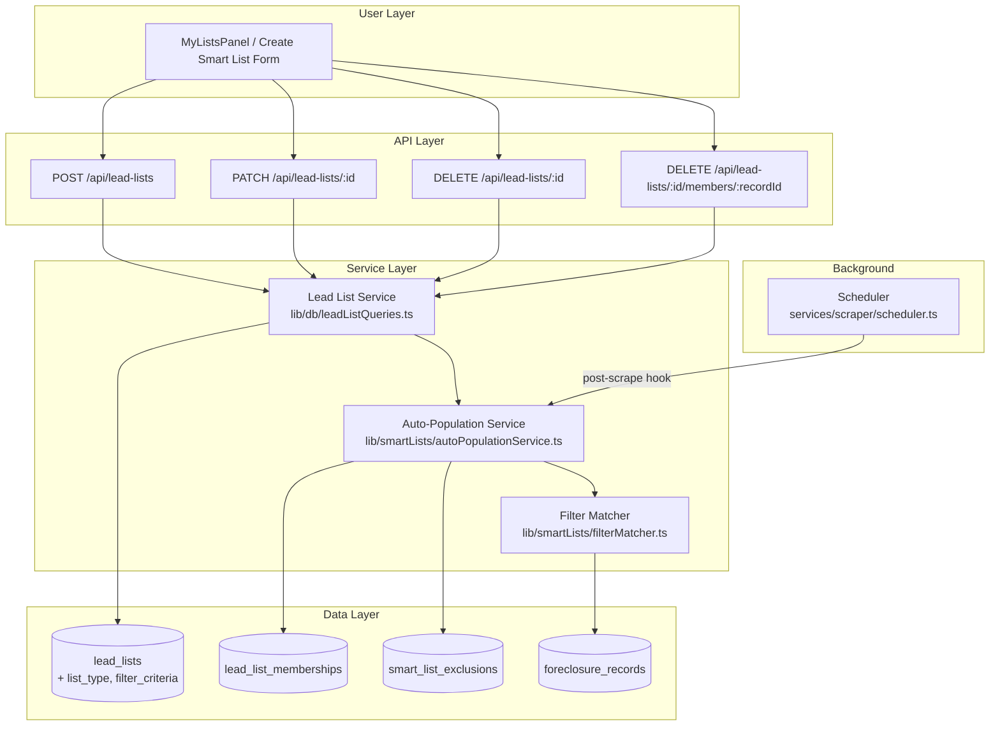
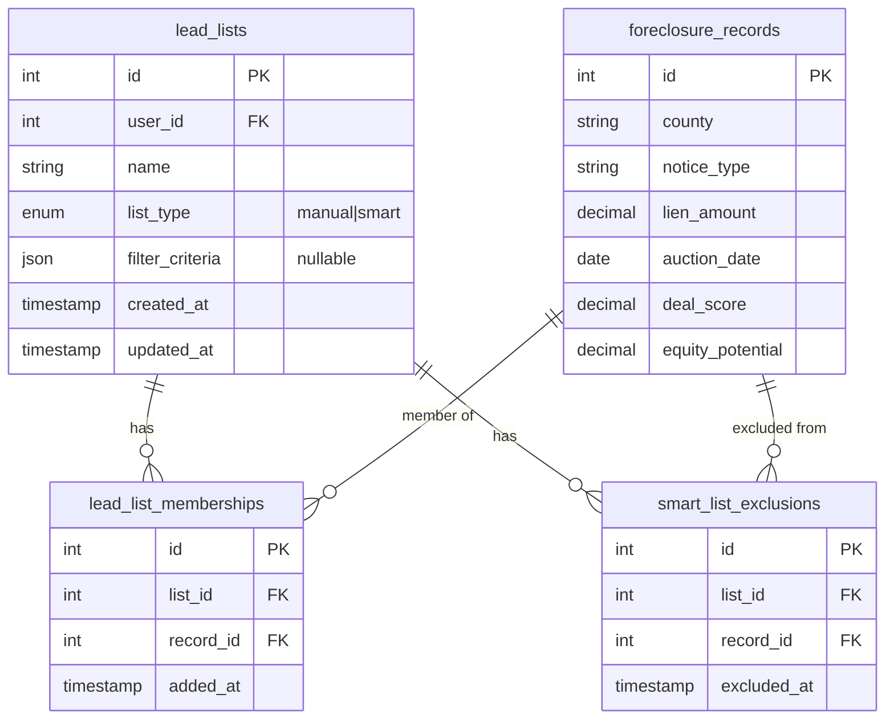
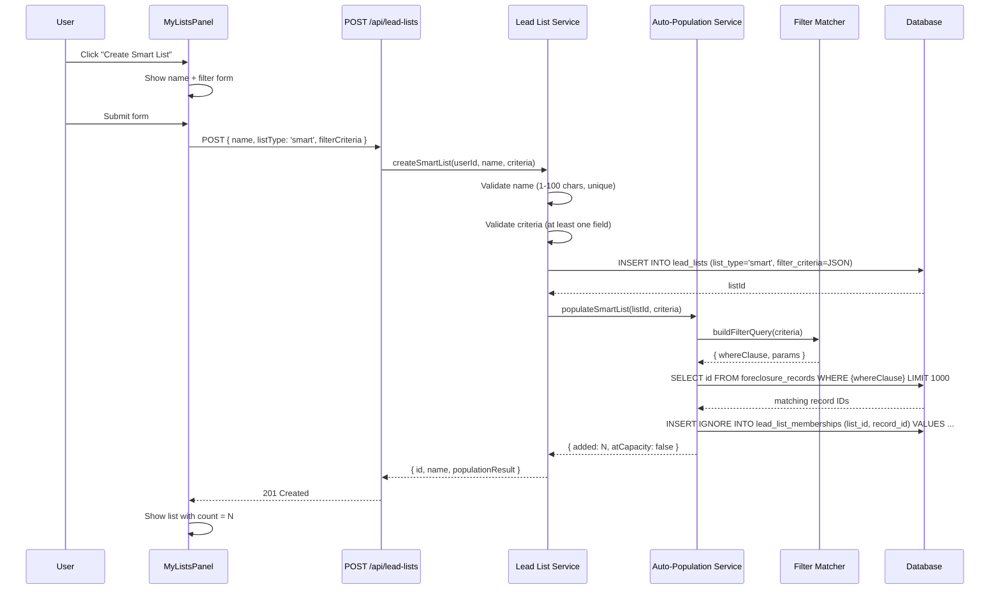
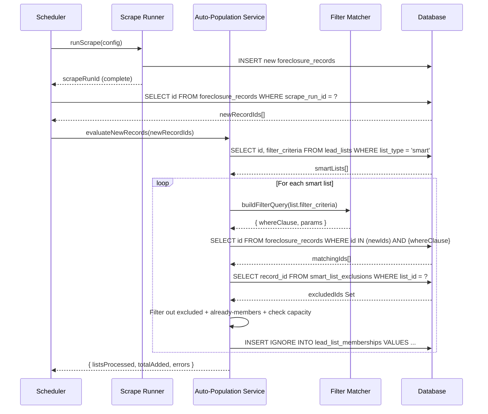
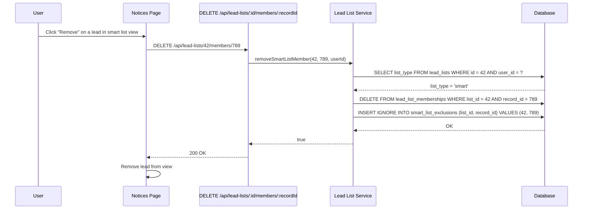
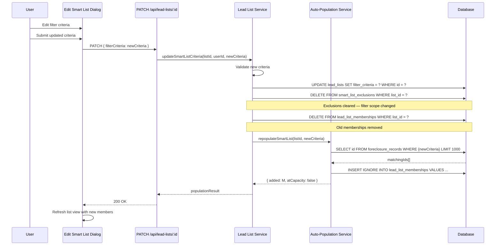

# Design Document: Smart Lists

## Overview

Smart Lists extends the existing Lead Lists feature by adding a new list type that auto-populates based on saved filter criteria. When a user creates a smart list with specific conditions (counties, notice types, lien range, date range, deal score, equity potential), the system automatically adds matching foreclosure records — both existing records at creation time and new records as they arrive from the daily scraper.

The design reuses the existing `SavedSearchFilters` matching pattern from `lib/savedSearches/matcher.ts` and the post-scrape hook pattern from the scheduler. Smart lists coexist with manual lists through a `list_type` discriminator column, sharing the same `lead_list_memberships` junction table.

**Key design decisions:**
- Discriminated union via `list_type` ENUM on `lead_lists` (no separate table)
- Filter criteria stored as JSON on the same row (mirrors `saved_searches.filters` pattern)
- Exclusion tracking via a dedicated `smart_list_exclusions` table (not JSON, for query efficiency)
- Auto-population runs as a post-scrape hook — same pattern as saved search notifications
- Initial population is synchronous on creation (bounded by 1000-record cap)
- Filter edit triggers full rebuild: clear exclusions → delete old memberships → repopulate

## Architecture



## Components and Interfaces

### 1. Filter Matcher (`lib/smartLists/filterMatcher.ts`)

Pure function module that builds SQL WHERE clauses from filter criteria. Extracted from the matching logic to be shared between initial population, post-scrape evaluation, and re-evaluation.

```typescript
export interface SmartListFilterCriteria {
  counties?: string[];
  noticeTypes?: string[];
  minLien?: number;
  maxLien?: number;
  auctionDateFrom?: string; // ISO date 'YYYY-MM-DD'
  auctionDateTo?: string;   // ISO date 'YYYY-MM-DD'
  minDealScore?: number;    // 0-100
  minEquityPotential?: number; // percentage
}

export interface FilterQuery {
  whereClause: string;
  params: (string | number)[];
}

/**
 * Build a SQL WHERE clause from filter criteria.
 * All specified criteria are combined with AND logic.
 * Returns empty whereClause if no criteria are specified.
 */
export function buildFilterQuery(criteria: SmartListFilterCriteria): FilterQuery;

/**
 * Validate that at least one filter criterion is specified.
 * Returns true if the criteria object has at least one non-empty field.
 */
export function hasAtLeastOneCriterion(criteria: SmartListFilterCriteria): boolean;

/**
 * Validate filter criteria values (types, ranges, formats).
 * Returns array of validation error messages (empty = valid).
 */
export function validateFilterCriteria(criteria: SmartListFilterCriteria): string[];
```

### 2. Auto-Population Service (`lib/smartLists/autoPopulationService.ts`)

Orchestrates matching and membership management for smart lists.

```typescript
export interface PopulationResult {
  listId: number;
  added: number;
  skipped: number; // already members or excluded
  atCapacity: boolean;
}

/**
 * Initial population: evaluate filter criteria against ALL existing records.
 * Called synchronously during smart list creation.
 * Respects the 1000-member capacity limit.
 */
export async function populateSmartList(listId: number, criteria: SmartListFilterCriteria): Promise<PopulationResult>;

/**
 * Incremental population: evaluate new record IDs against all smart lists.
 * Called as post-scrape hook after new records are inserted.
 * Respects exclusion sets and capacity limits per list.
 */
export async function evaluateNewRecords(newRecordIds: number[]): Promise<{
  listsProcessed: number;
  totalAdded: number;
  errors: number;
}>;

/**
 * Full re-evaluation: clear memberships and repopulate from scratch.
 * Called when filter criteria are edited.
 * Exclusions are cleared BEFORE this runs (handled by caller).
 */
export async function repopulateSmartList(listId: number, criteria: SmartListFilterCriteria): Promise<PopulationResult>;
```

### 3. Extended Lead List Queries (`lib/db/leadListQueries.ts`)

Extensions to the existing query module:

```typescript
// Extended LeadListRow to include smart list fields
export interface LeadListRow extends RowDataPacket {
  id: number;
  user_id: number;
  name: string;
  list_type: 'manual' | 'smart';
  filter_criteria: SmartListFilterCriteria | null;
  lead_count: number;
  created_at: string;
  updated_at: string;
}

/**
 * Create a smart list with filter criteria.
 * Validates name + criteria, inserts record, triggers initial population.
 */
export async function createSmartList(
  userId: number,
  name: string,
  criteria: SmartListFilterCriteria
): Promise<{ id: number; name: string; populationResult: PopulationResult }>;

/**
 * Update smart list filter criteria.
 * Clears exclusions, deletes old memberships, repopulates.
 */
export async function updateSmartListCriteria(
  listId: number,
  userId: number,
  criteria: SmartListFilterCriteria
): Promise<PopulationResult>;

/**
 * Remove a member from a smart list (with exclusion tracking).
 */
export async function removeSmartListMember(
  listId: number,
  recordId: number,
  userId: number
): Promise<boolean>;

/**
 * Delete a smart list (cascades memberships + exclusions).
 */
export async function deleteSmartList(listId: number, userId: number): Promise<boolean>;

/**
 * Get all smart lists (for scheduler hook).
 */
export async function getAllSmartLists(): Promise<Array<{
  id: number;
  user_id: number;
  filter_criteria: SmartListFilterCriteria;
}>>;

/**
 * Get exclusion set for a smart list.
 */
export async function getExclusions(listId: number): Promise<Set<number>>;

/**
 * Clear all exclusions for a smart list.
 */
export async function clearExclusions(listId: number): Promise<void>;
```

### 4. API Routes

| Method | Path | Description |
|--------|------|-------------|
| POST | `/api/lead-lists` | Extended — accepts `listType: 'smart'` + `filterCriteria` |
| PATCH | `/api/lead-lists/[id]` | Extended — supports `filterCriteria` update for smart lists |
| DELETE | `/api/lead-lists/[id]/members/[recordId]` | Extended — adds exclusion for smart lists |
| GET | `/api/lead-lists` | Extended — returns `list_type` and `filter_criteria` fields |

### 5. Scheduler Integration

Add a post-scrape hook call in `services/scraper/scheduler.ts` after `runScrape()` completes:

```typescript
// In the triggerScheduledScrape function, after runScrape completes:
import { evaluateNewRecords } from '../../lib/smartLists/autoPopulationService';

// After scrape, get IDs of newly inserted records from this run
const newRecordIds = await getNewRecordIdsFromRun(scrapeRunId);
if (newRecordIds.length > 0) {
  console.log(`[Scheduler] Evaluating ${newRecordIds.length} new records against smart lists...`);
  const result = await evaluateNewRecords(newRecordIds);
  console.log(`[Scheduler] Smart list auto-population: ${result.listsProcessed} lists, ${result.totalAdded} added, ${result.errors} errors`);
}
```

## Data Models

### Schema Changes

```sql
-- Migration: Smart Lists schema extension
-- Adds list_type, filter_criteria to lead_lists and creates exclusions table

-- 1. Add list_type discriminator column
ALTER TABLE lead_lists
  ADD COLUMN list_type ENUM('manual', 'smart') NOT NULL DEFAULT 'manual' AFTER name;

-- 2. Add filter_criteria JSON column (nullable — only populated for smart lists)
ALTER TABLE lead_lists
  ADD COLUMN filter_criteria JSON DEFAULT NULL AFTER list_type;

-- 3. Backfill: all existing lists are manual (DEFAULT handles this, but explicit for safety)
UPDATE lead_lists SET list_type = 'manual' WHERE list_type = 'manual';

-- 4. Create exclusions table
CREATE TABLE IF NOT EXISTS smart_list_exclusions (
  id INT AUTO_INCREMENT PRIMARY KEY,
  list_id INT NOT NULL COMMENT 'FK to lead_lists.id',
  record_id INT NOT NULL COMMENT 'FK to foreclosure_records.id',
  excluded_at TIMESTAMP DEFAULT CURRENT_TIMESTAMP,

  UNIQUE KEY uq_list_record_exclusion (list_id, record_id),
  INDEX idx_list_id (list_id),
  CONSTRAINT fk_exclusion_list FOREIGN KEY (list_id) REFERENCES lead_lists(id) ON DELETE CASCADE,
  CONSTRAINT fk_exclusion_record FOREIGN KEY (record_id) REFERENCES foreclosure_records(id) ON DELETE CASCADE
) ENGINE=InnoDB DEFAULT CHARSET=utf8mb4 COLLATE=utf8mb4_unicode_ci;

-- 5. Index for efficient smart list lookup during auto-population
ALTER TABLE lead_lists ADD INDEX idx_list_type (list_type);
```

### Entity Relationships



### Filter Criteria JSON Schema

```json
{
  "counties": ["Fulton", "DeKalb"],
  "noticeTypes": ["mortgage_foreclosure", "tax_sale"],
  "minLien": 50000,
  "maxLien": 500000,
  "auctionDateFrom": "2026-01-01",
  "auctionDateTo": "2026-12-31",
  "minDealScore": 60,
  "minEquityPotential": 20
}
```

All fields are optional. At least one must be specified.

## Sequence Diagrams

### Smart List Creation with Initial Population



### New Record Auto-Population (Post-Scrape Hook)



### Manual Removal with Exclusion



### Filter Criteria Edit with Re-Evaluation



## Correctness Properties

*A property is a characteristic or behavior that should hold true across all valid executions of a system — essentially, a formal statement about what the system should do. Properties serve as the bridge between human-readable specifications and machine-verifiable correctness guarantees.*

### Property 1: Filter Matching Correctness (AND Logic)

*For any* valid filter criteria and *for any* foreclosure record, the record is included in the match set if and only if it satisfies every specified criterion: county ∈ criteria.counties (case-insensitive), notice_type ∈ criteria.noticeTypes, minLien ≤ lien_amount ≤ maxLien, auctionDateFrom ≤ auction_date ≤ auctionDateTo, deal_score ≥ minDealScore, and equity_potential ≥ minEquityPotential. Unspecified criteria are ignored (treated as "any value").

**Validates: Requirements 2.2, 2.3, 2.4, 2.5, 2.6, 2.7, 2.8**

### Property 2: Exclusion Prevents Addition

*For any* smart list and *for any* record ID that exists in that list's exclusion set, the auto-population service shall never add that record to the list, regardless of whether it matches the filter criteria.

**Validates: Requirements 3.4, 4.2, 4.3**

### Property 3: Removal from Smart List Creates Exclusion

*For any* smart list and *for any* record that is currently a member, removing that record shall both delete the membership row AND insert the record ID into the exclusion set.

**Validates: Requirements 4.1**

### Property 4: Manual List Removal Has No Exclusion Side Effect

*For any* manual list (list_type = 'manual') and *for any* member record, removing that record shall delete the membership row but shall NOT create any entry in the smart_list_exclusions table.

**Validates: Requirements 4.4**

### Property 5: Re-Evaluation Produces Correct Membership Set

*For any* smart list, after a filter criteria edit and re-evaluation, the membership set shall be exactly equal to the set of foreclosure records matching the new criteria (with the 1000-member cap applied). No exclusions exist because they were cleared before re-evaluation.

**Validates: Requirements 6.1, 6.2**

### Property 6: Criteria Edit Clears Exclusions

*For any* smart list with a non-empty exclusion set, editing the filter criteria shall result in an empty exclusion set (all rows deleted from smart_list_exclusions for that list_id).

**Validates: Requirements 6.3**

### Property 7: Rename Does Not Trigger Re-Evaluation

*For any* smart list, renaming it shall not change the membership set (same record IDs before and after) and shall not modify the filter_criteria or exclusion set.

**Validates: Requirements 6.4**

### Property 8: Auto-Population Idempotency

*For any* smart list and *for any* set of records, running the auto-population service multiple times with the same input shall produce the same membership set — no duplicate memberships are created.

**Validates: Requirements 3.5**

### Property 9: Cascade Delete Preserves Foreclosure Records

*For any* smart list with N members, deleting the list shall remove the list row, all N membership rows, and all exclusion rows, but every foreclosure record referenced by those memberships shall still exist in the foreclosure_records table.

**Validates: Requirements 8.2**

### Property 10: Capacity Enforcement

*For any* smart list that has reached 1000 members, the auto-population service shall not add any additional records to that list, even if they match the filter criteria.

**Validates: Requirements 9.2**

### Property 11: Multi-List Matching

*For any* new foreclosure record that matches the filter criteria of N distinct smart lists (and is not excluded from any of them), the auto-population service shall add that record to all N lists.

**Validates: Requirements 3.3**

## Error Handling

| Scenario | Handling |
|----------|----------|
| Invalid filter criteria (no fields specified) | Return 422 with `INVALID_CRITERIA` error code |
| Filter criteria with invalid types (e.g., string for minLien) | Return 422 with field-level validation errors |
| Smart list creation DB failure | Return 500, no partial state (transaction rollback) |
| Initial population exceeds 10s timeout | Log warning, return partial result, mark list as needing refresh |
| Single smart list fails during batch auto-population | Log error, continue processing remaining lists |
| Record already excluded | `INSERT IGNORE` — no error, operation is idempotent |
| Record already a member | `INSERT IGNORE` — no error, skipped count incremented |
| List at capacity during auto-population | Log warning, skip additions for this list, set `atCapacity: true` |
| Filter criteria references non-existent county | No error — query returns zero matches (valid empty result) |
| Concurrent filter edit + auto-population race | Use row-level locking on the list during re-evaluation |

### Transaction Strategy

- **Smart list creation**: Single transaction wrapping INSERT into `lead_lists` + initial population INSERT into `lead_list_memberships`
- **Filter criteria edit**: Single transaction wrapping UPDATE criteria + DELETE exclusions + DELETE memberships + INSERT new memberships
- **Post-scrape auto-population**: One transaction per smart list (isolate failures)
- **Member removal**: Single transaction wrapping DELETE membership + INSERT exclusion

## Testing Strategy

### Property-Based Tests (fast-check)

The feature's core matching logic and state transitions are well-suited to property-based testing. Use `fast-check` (already available in the ecosystem or easily added as a dev dependency).

**Configuration:**
- Minimum 100 iterations per property test
- Each test references its design document property via tag comment
- Tag format: `Feature: smart-lists, Property {number}: {description}`

**Property tests to implement:**
- Property 1: Generate random `SmartListFilterCriteria` + random foreclosure records → verify matching logic
- Property 2: Generate matching records + exclusion sets → verify excluded records never added
- Property 3: Generate smart list members → verify removal creates exclusion
- Property 4: Generate manual list members → verify removal has no exclusion
- Property 5: Generate criteria, populate, edit criteria → verify membership = new match set
- Property 6: Generate list with exclusions, edit criteria → verify exclusions empty
- Property 7: Generate populated smart list, rename → verify memberships unchanged
- Property 8: Run population twice → verify no duplicates
- Property 9: Delete list → verify foreclosure records still exist
- Property 10: List at 1000 members + matching records → verify no additions
- Property 11: Multiple lists + matching record → verify record in all matching lists

### Unit Tests (example-based)

- Validation: empty criteria rejected, single-field criteria accepted, name validation
- Edge cases: zero-match criteria, all-match criteria, capacity boundary (999 → 1000)
- Error resilience: single list failure doesn't crash batch
- API response shapes for create/edit/delete

### Integration Tests

- Full creation flow: API call → DB state → initial population count
- Post-scrape hook: insert records → trigger hook → verify memberships created
- Backward compatibility: all existing manual list API tests pass unchanged
- Performance: initial population < 10s for 1000 records, batch < 60s for 500 records × 200 lists

### UI Tests (example-based)

- Smart list shows ⚡ icon
- Create flow offers Manual vs Smart choice
- Filter summary tags display correctly
- "Add to List" hidden for smart lists
- Capacity indicator shows at 1000 members
- Confirmation dialog on delete
